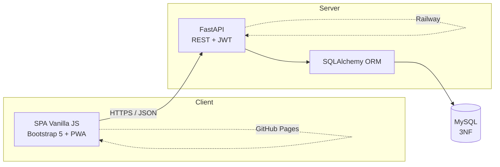
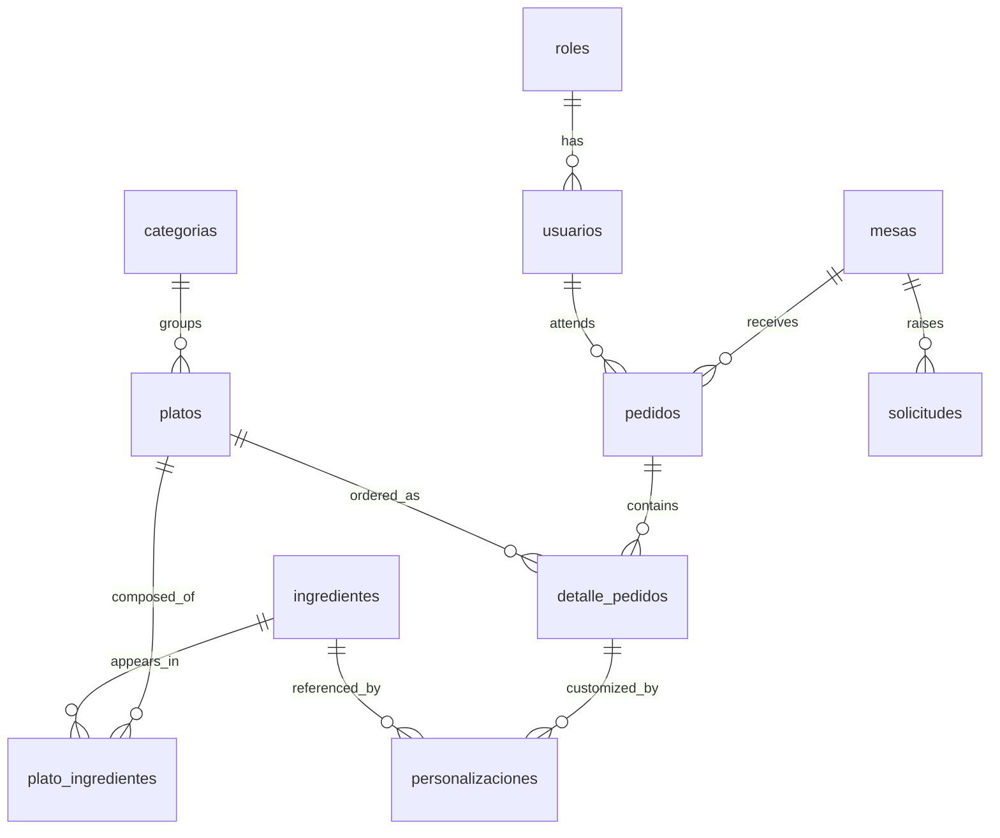

# Technical Document — Nexora

**Proyecto Integrador · CodeUp Riwi: Beyond Limits · Ruta Básica**

| | |
|---|---|
| **Project** | Nexora — Digital menu and QR ordering for restaurants |
| **Team** | Kerin Barranco · Yesid Palacio · Marlon Castillo |
| **Category** | Productivity / Technology and Innovation |
| **Repository** | https://github.com/Kerin0011/ProyectoInt |
| **Frontend** | GitHub Pages |
| **Backend** | Railway |

---

## 1. Project name

**Nexora** — a web application that lets diners scan the QR code on their
table, browse the menu, customize their dishes and order from their own phone,
while the restaurant manages the whole service from an authenticated panel.

---

## 2. General objective

Design and build a functional web application that removes the friction of
ordering in a restaurant, by connecting the diner's phone directly with the
kitchen through a digital menu tied to each table, with real-time order
tracking and inventory control.

---

## 3. Specific objectives

1. Build a REST API with real business logic — an order state machine, dish
   customization with live pricing, and inventory deduction — rather than a
   plain CRUD.
2. Model the domain in a relational database normalized to Third Normal Form.
3. Develop a Single Page Application in vanilla JavaScript, responsive and
   installable as a PWA, with no frontend framework.
4. Secure the panel with JWT authentication and role-based authorization.
5. Guarantee data integrity by validating every input at the API boundary.
6. Deploy the solution so it is reachable from any phone with a QR scanner.
7. Cover the business logic with automated tests.

---

## 4. Problem identified

Ordering in a restaurant still depends on a waiter being physically available.
That creates friction the diner feels and the restaurant pays for:

- **Waiting.** The diner waits for someone to take the order, and waits again
  to ask for the bill. On a busy night the wait is the complaint, not the food.
- **Transcription errors.** The waiter memorizes or writes down "no onion,
  extra cheese"; something gets lost between the table and the kitchen.
- **Opaque customization.** The diner does not know what an extra costs until
  the bill arrives.
- **No visibility.** "Is my order coming?" has no answer other than asking
  again.
- **Menu on paper.** Changing a price or marking a dish sold out means
  reprinting, so the menu is always slightly out of date and diners order what
  does not exist.
- **Blind inventory.** The kitchen finds out an ingredient ran out when the
  dish has already been ordered.

The common root: **the information lives in the waiter's head**, and it does
not scale.

Nexora moves that information to a system both sides can read: the diner orders
and tracks from their phone, and the restaurant updates the menu, the
availability and the state of every order in real time.

---

## 5. Scope

### Included

- Digital menu per table, reachable by a unique QR code, with no app to install
  and no sign-up for the diner.
- Ordering with customization: add extras with live pricing, remove
  ingredients, and a free-text note per dish for the kitchen.
- Order lifecycle with validated transitions.
- Real-time tracking for the diner.
- Authenticated panel with two roles: `admin` and `mozo`.
- CRUD for tables, dishes, ingredients and categories.
- Inventory that deducts on every order and marks ingredients sold out.
- "Call the waiter" and "ask for the bill" requests.
- PWA with an offline menu.

### Not included

- **Online payments.** The bill is still settled with the waiter. It would mean
  a payment gateway, PCI compliance and a refund flow — a project of its own.
- **Multi-restaurant / multi-branch.** The model assumes a single restaurant.
- **Sales reporting.** Out of the MVP; the data is there to build it later.
- **Table reservations.**
- **Push notifications** when the order is ready.

### Assumptions

- The diner has a phone with a camera and internet.
- Each table has its QR printed and visible.
- The restaurant has one device to run the panel.

---

## 6. User stories

13 stories, 68 story points, of which 12 belong to the MVP. See
**[user_stories.md](user_stories.md)** for the full detail with acceptance
criteria, and **[product_backlog.md](product_backlog.md)** for the task
breakdown per sprint.

| ID | Story | Priority | MVP |
|---|---|---|---|
| US01 | Authentication and login | Must | Yes |
| US02 | Table and QR management | Must | Yes |
| US03 | Public menu via QR | Must | Yes |
| US04 | Order lifecycle | Must | Yes |
| US05 | Place an order from the QR | Must | Yes |
| US06 | Order tracking | Should | Yes |
| US07 | Customize dishes | Must | Yes |
| US08 | Dish management (CRUD) | Must | Yes |
| US09 | Dish availability | Should | Yes |
| US10 | Ingredient and inventory management | Must | Yes |
| US11 | Active orders dashboard | Should | Yes |
| US12 | Cancel an order | Should | Yes |
| US13 | Call the waiter / ask for the bill | Could | No |

---

## 7. Solution architecture

Three layers, deployed independently.



### Backend layers

```
routes/     HTTP: reads the request, returns the response, maps error codes
schemas/    Pydantic contract: what enters and leaves the API
services/   Cross-cutting logic: auth (JWT, roles, hashing), serializers
models/     SQLAlchemy: tables, relationships, connection, migrations
```

The dependency direction is one-way: `routes → schemas/services → models`. A
route never touches the database without going through a model, and a model
knows nothing about HTTP.

### Design decisions worth defending

**Why the state machine lives in the backend.** The valid transitions are a
dictionary in `routes/pedidos.py`. Putting it in the frontend would mean any
client could `PATCH` an order from `pendiente` straight to `entregado`. The
rule lives where it cannot be bypassed.

**Why stock is validated once per order and not per line.** Consumption is
accumulated into a dictionary across every line and checked just before the
commit. Validating line by line would let two lines of the same dish each pass
on their own and drive stock negative. There is a regression test for exactly
this.

**Why the price is recalculated on the server.** The frontend shows a live
price for UX, but the total that gets stored is computed from the database:
base price plus extras, read from `ingredientes.precio_extra`. If the client
sent the total, anyone could order a burger for $1.

**Why the QR carries an opaque token and not the table id.** `/menu/5` invites
you to try `/menu/6`. A random token per table cannot be guessed, and it can be
regenerated if it leaks.

**Why data migrations run at startup and are recorded.** The database lives on
Railway, with no console for manual work. `run_migrations()` runs on boot:
schema migrations are idempotent by asking whether the column exists, while
data migrations are recorded in `migraciones_aplicadas` so they run exactly
once — re-running them on every boot would refill stock that had already been
consumed.

---

## 8. Data model

Eleven tables in **Third Normal Form**.



| Table | Purpose |
|---|---|
| `roles` | `admin` and `mozo` |
| `usuarios` | Panel staff, with a hashed password |
| `mesas` | Tables, each with its unique QR token |
| `categorias` | Menu sections |
| `ingredientes` | Catalogue with stock and extra price |
| `platos` | Dishes, with price, availability and "recommended" flag |
| `plato_ingredientes` | N:M with attributes: how each ingredient takes part in a dish |
| `pedidos` | Order header: table, state, total |
| `detalle_pedidos` | Order lines: dish, quantity, price, note |
| `personalizaciones` | Each ingredient added or removed on a line, with its price |

### Normalization

**1NF** — every field is atomic. A dish's ingredients are not a comma-separated
list; they are rows in `plato_ingredientes`.

**2NF** — no partial dependency. `plato_ingredientes` has attributes
(`es_default`, `es_extra`, `es_removible`, `cantidad_default`) that depend on
the *pair* dish-ingredient, not on either one alone. Lettuce is removable in a
burger and not in a salad, so the flag belongs to the relationship.

**3NF** — no transitive dependency. `platos` stores `categoria_id`, never the
category name; `personalizaciones` stores `ingrediente_id`, never its name.
Renaming a category touches exactly one row.

### The deliberate exception

`detalle_pedidos.precio_unitario` and `personalizaciones.precio_adicional`
duplicate a price that already lives in `platos` and `ingredientes`. This is
denormalization on purpose: an order is a **historical record**. If the burger
goes up to $18.000 tomorrow, yesterday's order must still read $15.000. Reading
the price through the relationship would rewrite history every time the menu
changes.

### The N:M relationship, in detail

`plato_ingredientes` is the core of the customization. The three flags are what
make it work:

| Flag | Meaning | Example |
|---|---|---|
| `es_default` | Comes with the dish, and consumes stock | Beef in a burger |
| `es_extra` | Can be added for a price | Extra cheese |
| `es_removible` | Can be taken out by the diner | Lettuce |

They are not mutually exclusive: lettuce is `es_default` **and** `es_removible`.
The API enforces it — only an `es_extra` can be added, only an `es_removible`
can be removed.

The full schema, with seed data, is in
[`database/schema.sql`](../database/schema.sql).

---

## 9. Scrum evidence

Ways of working, board, ceremonies and progress: **[scrum.md](scrum.md)**.
Git conventions and branch model: **[git_workflow.md](git_workflow.md)**.

| Artifact | Where |
|---|---|
| Product Backlog | [product_backlog.md](product_backlog.md) |
| Sprint Backlog | [product_backlog.md](product_backlog.md), one section per sprint |
| User Stories | [user_stories.md](user_stories.md) |
| Prioritization | MoSCoW plus blocking dependency — [product_backlog.md](product_backlog.md) |
| Board | Trello (public link) |
| Responsibilities | Owner per task in the backlog |
| Meeting log | [scrum.md](scrum.md#5-meeting-log) |
| Progress tracking | [scrum.md](scrum.md#6-progress-tracking) |

Five one-week sprints: planning and design, backend core, business logic,
panel and hardening, integration and presentation.

---

## 10. Technology justification

### Backend — FastAPI over Flask

Both were allowed. FastAPI won on three counts:

- **Validation as part of the framework.** Pydantic validates the request body
  against the schema before the endpoint runs. In Flask that is hand-written
  code in every route — code that eventually forgets a case. Half the input
  bugs found in testing (negative quantities, empty orders) were fixed by
  declaring the constraint on the schema, not by writing an `if`.
- **Automatic documentation.** `/docs` publishes an interactive Swagger derived
  from the code, so the frontend developer tries endpoints without asking the
  backend developer anything.
- **Explicit types.** The signature states what enters and what leaves, which
  matters on a team where not everyone works on the same layer.

### Database — MySQL over MongoDB

The decision that most shaped the project.

The domain is **relational to the bone**. An order references a table, contains
lines, each line references a dish and carries customizations that reference
ingredients. It is a graph of entities where every edge matters.

- **Referential integrity.** Foreign keys make it impossible to store an order
  line pointing at a dish that does not exist. In MongoDB that guarantee is
  application code, and application code has bugs.
- **N:M with attributes.** `plato_ingredientes` is exactly what a junction
  table is for. Modelling it in MongoDB means either embedding ingredients in
  every dish — duplicating stock in dozens of documents — or keeping references
  and doing the join by hand.
- **Stock is the killer argument.** Stock is shared, mutable state that several
  orders touch at once. It needs a transaction: validate, deduct, commit, all
  or nothing. That is precisely what a relational engine gives and what a
  document store is not designed for.
- **3NF fits the data.** The domain has no free-form or variable-shape
  documents. It is tables with a fixed schema.

MongoDB would have been the right call for a variable-schema catalogue, or for
documents read whole and rarely cross-referenced. That is not this problem.

### Frontend — Vanilla JS + Bootstrap

Frameworks were not allowed, so the SPA is hand-written: a hash router, one
module per page, and `fetch` against the API. Bootstrap covers the grid and the
components so the effort goes into the flow, not into re-implementing a modal.
The PWA (manifest plus service worker) matters here for a concrete reason: the
menu is opened on a phone, in a restaurant, on a network that is often bad.

### Deployment — GitHub Pages + Railway

The frontend is static, so Pages serves it for free, deployed from a GitHub
Action on every push. The backend needs Python and MySQL, and Railway gives
both plus environment variables. Splitting them means a frontend change never
risks the API.

### Auth — JWT

The API is stateless and the frontend is served from a different origin than
the backend. A session cookie would mean shared state and CORS problems; a
signed token travels in the header and the server verifies it without looking
anything up.

---

## 11. MVP

**The minimum that delivers value: a diner scans, orders and tracks; the
restaurant receives it and manages it.**

Everything below is built, deployed and tested:

| Capability | Story | State |
|---|---|---|
| Login with roles | US01 | Done |
| Tables with a unique QR | US02 | Done |
| Public menu by QR | US03 | Done |
| Ordering with customization and notes | US05, US07 | Done |
| Live price recalculation | US07 | Done |
| Order lifecycle with validated transitions | US04 | Done |
| Real-time tracking | US06 | Done |
| Order dashboard | US11 | Done |
| Dish and ingredient CRUD | US08, US10 | Done |
| Availability and inventory | US09, US10 | Done |
| Order cancellation | US12 | Done |

**Left out of the MVP on purpose:** online payments, sales reporting,
multi-restaurant, push notifications. Each is a project of its own, and none is
needed for the core loop — scan, order, track, serve — to deliver value.

### Verification

- 36 automated tests over the business logic (`pytest`).
- 36 manual test cases: [test_cases.md](test_cases.md).
- 11 bugs found and fixed, logged with their commit.

---

## Appendix — Running it

Install, environment variables, deployment and the API reference are in the
[README](../README.md).
